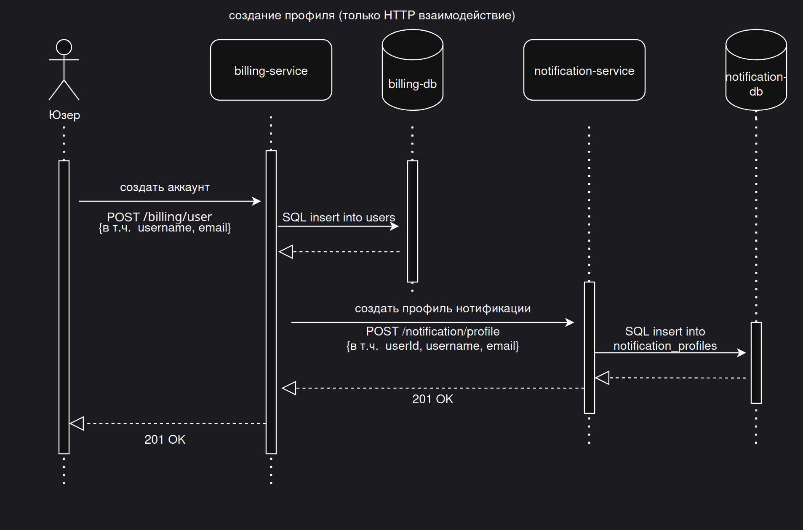
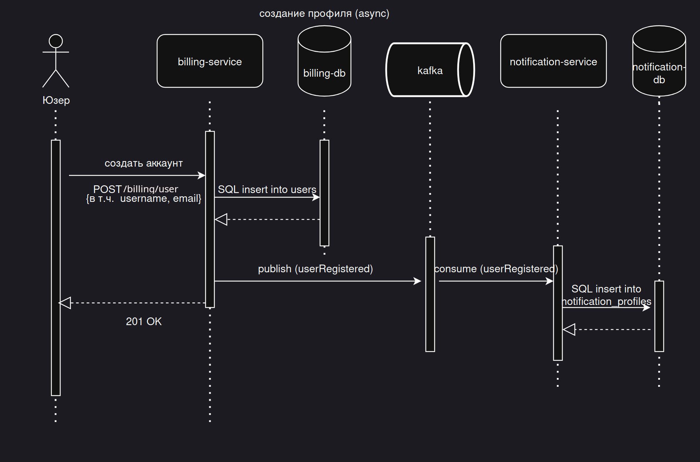
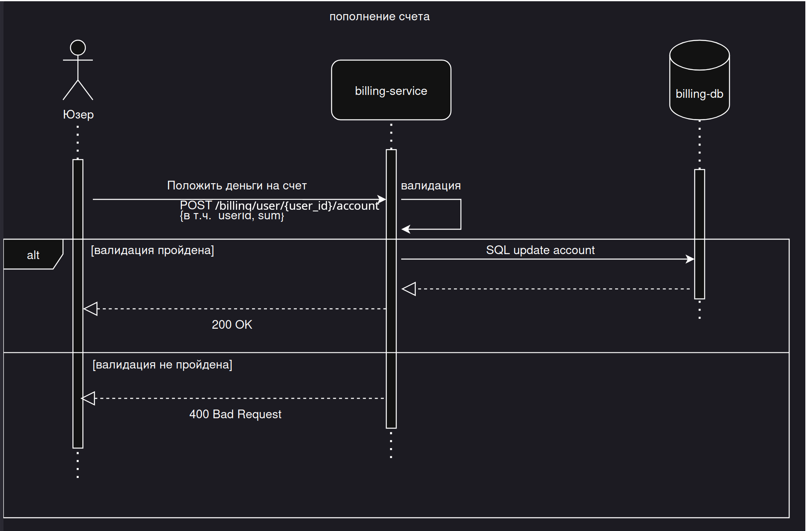
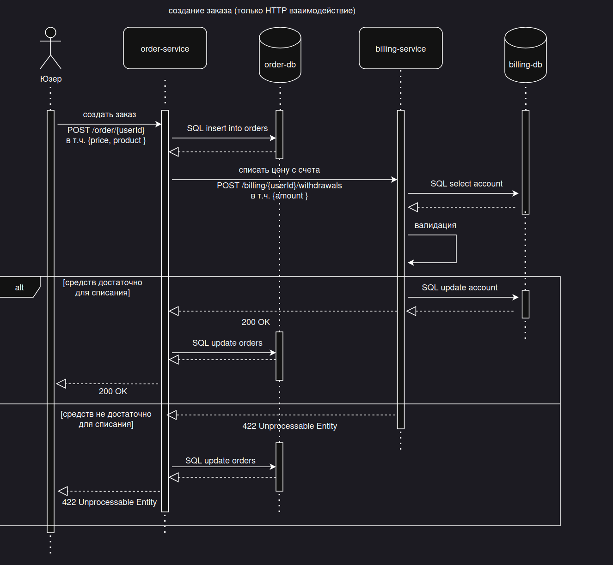
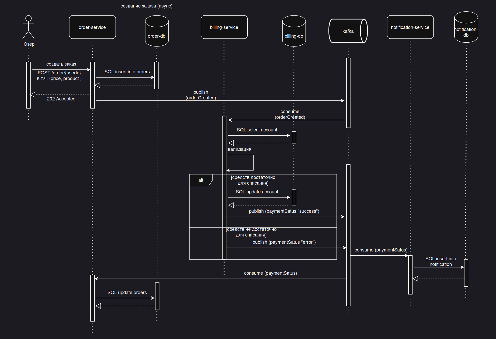
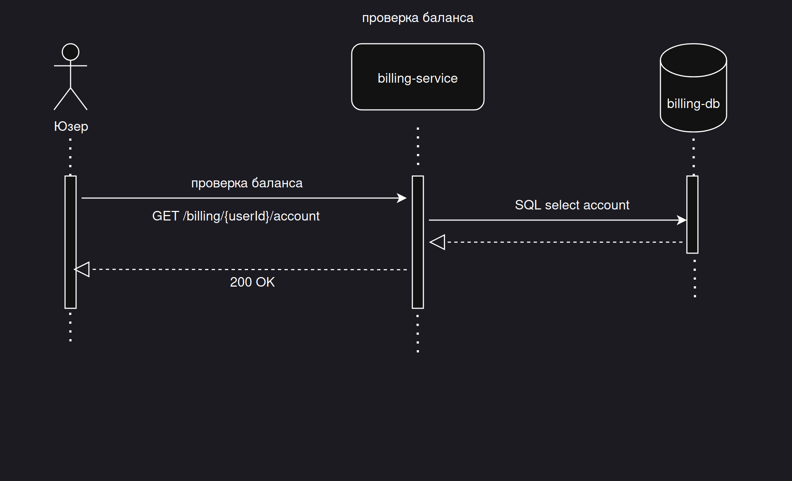
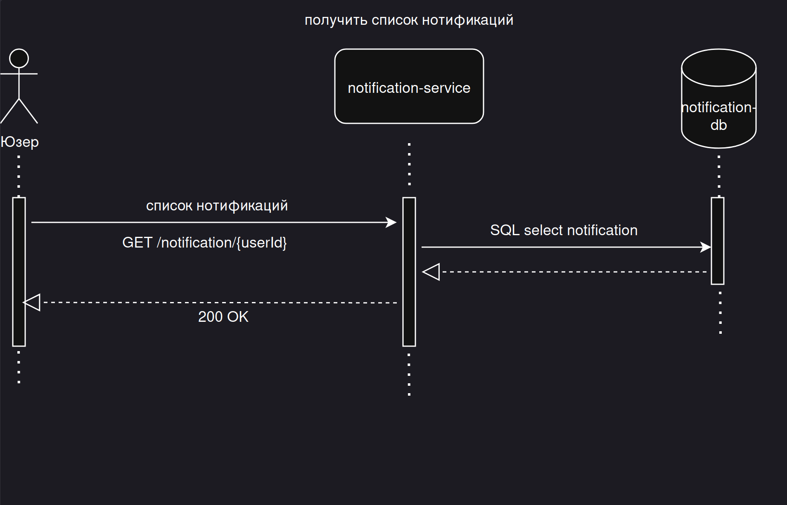

# ТЕОРЕТИЧЕСКАЯ ЧАСТЬ

## создание профиля



### Альтернативный асинхронный вариант



---

## пополнение счета

Асинхронный вариант не требуется — операция идемпотентна и выполняется атомарно без ожидания внешних подтверждений.



---

## создание заказа



### Альтернативный асинхронный вариант



---

## проверка баланса

Асинхронный вариант не требуется — read-only запрос, выполняется мгновенно без побочных эффектов.



---

## получить список нотификаций

Асинхронный вариант не требуется — read-only запрос возвращается без длительных операций.



---

## OpenAPI спецификации (IDL)

Интерактивный просмотр через [Swagger Editor](https://editor.swagger.io):

| Спецификация | Описание |
|---|---|
| [`billing.yaml`](https://editor.swagger.io/?url=https://raw.githubusercontent.com/adel-galyameev/stream_processing/main/openApi/billing.yaml) | Billing API — создание пользователя, пополнение счёта, проверка баланса, списание средств |
| [`order.yaml`](https://editor.swagger.io/?url=https://raw.githubusercontent.com/adel-galyameev/stream_processing/main/openApi/order.yaml) | Order API — создание заказа |
| [`notification.yaml`](https://editor.swagger.io/?url=https://raw.githubusercontent.com/adel-galyameev/stream_processing/main/openApi/notification.yaml) | Notification API — создание профиля нотификации, получение списка уведомлений |

# ПРАКТИЧЕСКАЯ ЧАСТЬ


Для реализации были выбраны доступные асинхронные варианты операций

### 1.1 описание архитектурного решения:
Я не стал ограничиваться исключительно синхронным HTTP-взаимодействием или Event Collaboration.
Некоторые операции реализованы как синхронные (пополнение счёта, проверка баланса и получение списка уведомлений).
Другие реализованы как Event Collaboration (создание профиля и оформление заказа).
Такой подход мне кажется разумным, без излишнего увлечения одним из методов.

### 1.2 схема взаимодействия сервисов представлена выше в виде sequence диаграмм

### 2.1 компоненты helm-а:
- postgresql (StatefulSet)
- kafka (Deployment)
- notification (Deployment) [ссылка на git репозиторий](https://github.com/adel-galyameev/notification)
- order (Deployment) [ссылка на git репозиторий](https://github.com/adel-galyameev/order)
- billing (Deployment) [ссылка на git репозиторий](https://github.com/adel-galyameev/billing)

#### P.S. Для развертывания базы данных и брокера сообщений никаких отдельных команд не требуется (всё устанавливается одной командой запуска чарта). В целях упрощения сервисы подключаются к одной БД, а топики в Кафке создаются автоматически.

### 2.2 команда установки приложения из helm-а (выполнять в корне репозитория):
#### Предварительные требования

- Minikube запущен
- установлен  nginx через helm (как описано в Базовые сущности Kubernetes: Service, Ingress // ДЗ)

```bash
helm install orders-chart ./orders-chart
```

**Ожидаемый ответ:**

```bash
NAME: orders-chart
LAST DEPLOYED: Mon May  4 12:37:17 2026
NAMESPACE: default
STATUS: deployed
REVISION: 1
```
### 2.3 остановка helm чарта:

```bash
helm uninstall orders-chart
```

**Ожидаемый ответ:**

```bash
release "orders-chart" uninstalled
```

### 3 запуск тестов постмана:

```bash
newman run orders-api-test.postman_collection.json \
  --env-var "baseUrl=http://arch.homework"  \
  --reporters cli \
  --verbose
```